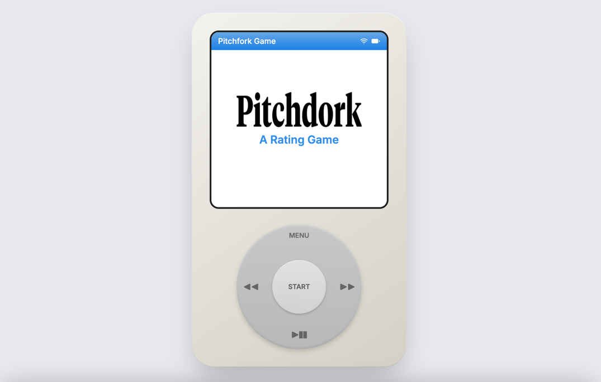

# Pitchdork 
## What is Pitchdork?
[Deployed in Vercel here.](https://pitchdork-fe-git-main-karinadelchevas-projects.vercel.app/)


Pitchdork is a music discovery and trivia-style web app centered around Pitchfork album reviews. The data for the reviews comes from a large dataset available on hugging face. This dataset has been hosted on Supabase, to allow easy, plug n play API access.

This repo is its modern single-page web application built with React, TypeScript, and Vite.  
This frontend is structured for fast iteration, type safety, and a great developer experience, using Tailwind CSS for styling and a rich set of Radix UI / shadcn components.

## Supabase integration

This project uses **Supabase** as its backend-as-a-service and database layer:

- **Database & Tables**
    - A table (or view) that returns **random albums** is used to power features like “give me a random selection of albums.”
    - A main **reviews table** stores album review data (album name, artist, rating, year, review text, reviewer, genre, label, etc.).

- **Data Access**
    - The frontend talks to Supabase directly from the browser using the Supabase JavaScript client.
    - It loads:
        - A **set of random albums** (for discovery and game-like flows).
        - **Albums by ID** or **a single album by ID** (for detail pages or specific question/answer rounds).

- **Authentication & Security**
    - The frontend uses a **publishable (anon) Supabase key** suitable for client-side usage.
    - Row-level security and more sensitive operations should be enforced on the Supabase side; this app focuses on read-oriented, client-safe operations.

In short, Supabase hosts the album review data and provides an easy way for the frontend to query both random selections and specific records, without running a separate custom backend.

---

## Features

- ⚡ Fast dev server and HMR via Vite
- ⚛️ React 18 with functional components and hooks
- 🧾 TypeScript for end‑to‑end type safety
- 🎨 Tailwind CSS utility‑first styling
- 🧱 Accessible UI primitives via Radix UI & shadcn‑style components
- 🔀 Client‑side routing with `react-router-dom`
- 📡 Data fetching and caching with `@tanstack/react-query`
- ✅ Form handling and validation with `react-hook-form` + Zod
- ☁️ Ready to integrate with Supabase via `@supabase/supabase-js`
- 📊 Data visualization with `recharts`

---

## Tech Stack

- **Runtime:** Node.js (npm)
- **Build tool:** [Vite](https://vitejs.dev/)
- **Language:** TypeScript
- **Framework:** React 18
- **Routing:** `react-router-dom`
- **Styling:** Tailwind CSS, Tailwind Typography, `tailwindcss-animate`
- **DB and API:** Supabase
---

## Getting Started

### Prerequisites

- **Node.js**: v18+ recommended
- **npm**: comes with Node.js


## Scripts

Common npm scripts you can use:

- `npm run dev` – Start the Vite development server
- `npm run build` – Create a production build
- `npm run build:dev` – Create a development-mode build (useful for testing)
- `npm run preview` – Preview the production build locally
- `npm run lint` – Run ESLint over the codebase

---

## Environment Variables

This project is set up to work well with frontend-friendly environment variables (for example with Supabase or external APIs).  
In Vite, variables exposed to the client typically start with `VITE_`.

Typical setup:

1. Create a `.env.local` (or `.env`) file in the project root.
2. Add your variables, for example:

   ```bash
   VITE_SUPABASE_URL=your-project-url
   VITE_SUPABASE_ANON_KEY=your-anon-key
   ```

3. Restart the dev server after changing env files.

> Keep secrets (service role keys, private tokens) **out of** the frontend code and out of version control.

---
